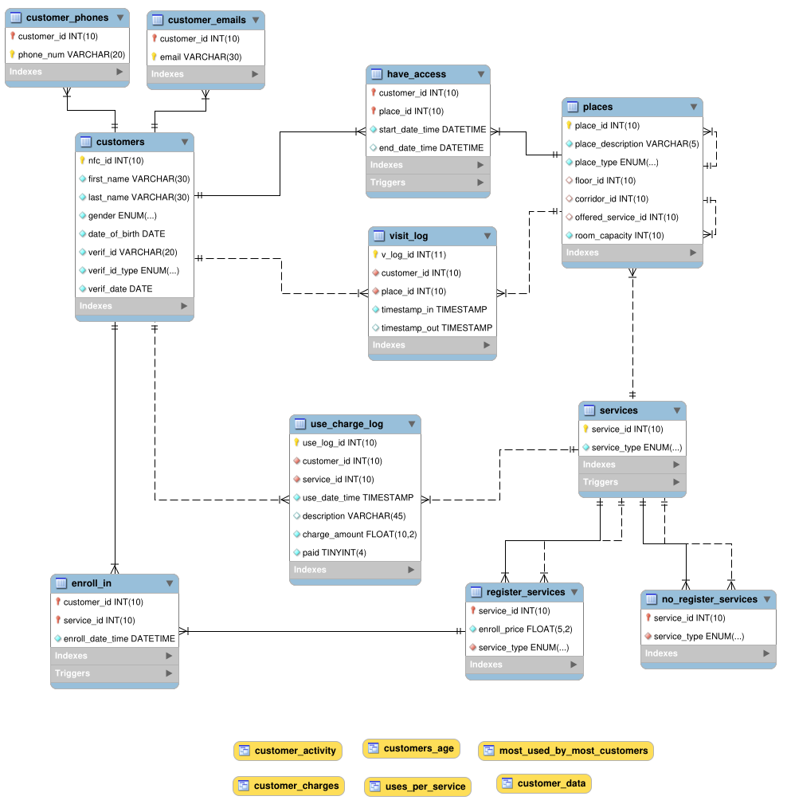

# Hotel Customer Activity Web Application

## Introduction

Semestrial student project for the course "Introduction to Databases" taught at ECE NTUA 2021. Essentially, a PHP - MySQL application that manages a hypothetical hotel with NFC-enabled access for every room and tracks the activity of customers who have been (possibly) infected with COVID-19. Graded 100/100.

## Tools Used

-   MariaDB 15.1
-   Apache Server 2.4.47-1
-   PHP 8.0.6
-   HTML-CSS-Javascript
-   Bootstrap 5
-   jQuery Datatables
-   Python 3.9

## Functionality

-   Basic hotel management operations
    -   View customer information
    -   Insert new customer
    -   Make a room reservation
    -   Enroll customer in non-free services
    -   Check out a customer
-   Customer activity statistics per age group
    -   Most visited places
    -   Most used services
    -   Charges per service
-   COVID-19
    -   View the visit log of customer infected with COVID-19
    -   Find out other possibly infected customers

## Relational Diagram

## Installation on localhost

1. Get the Apache/MySQL/PHP stack
2. Clone the codebase

    `$ git clone https://github.com/stefanaki/asdf-app.git`

3. Import the database from the latest dump located in [`database/dumps`](./database/dumps/)
4. Alter the file `db_connect.php` to match your root credentials
5. Use the application by visiting http://localhost/

## Partners

-   Odysseas Boufalis
-   Anna Douska
